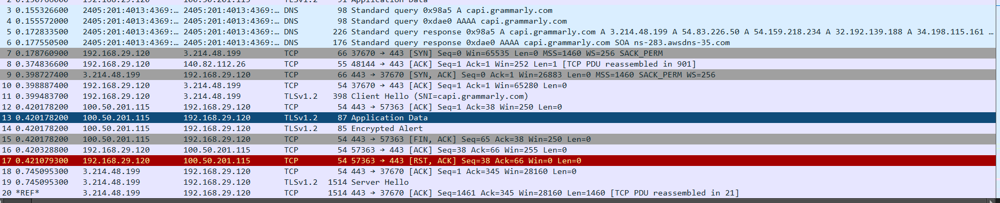

# 🦈 Network Traffic Analysis using Wireshark

## 📝 Project Overview
This project focuses on capturing and analyzing live network traffic to understand data flow, protocol structures, and network behavior. Using **Wireshark**, I performed packet sniffing to identify key protocols and troubleshoot network anomalies.

## 🛠️ Technical Specifications
*   **Operating System:** Windows 11 (utilizing Npcap)
*   **Analysis Tool:** Wireshark
*   **Traffic Sources:** Web Browser (HTTP/TLS)
*   **File Format:** `.pcapng` (Packet Capture)

## 🚀 Implementation Steps
1.  **Interface Selection:** Identified the active network interface and initiated a live capture.
2.  **Traffic Generation:** 
    *   Navigated to `[http://example.com](https://www.ilovepdf.com/)` to capture unencrypted web traffic.
3.  **Protocol Filtering:** Utilized Wireshark's display filter bar to isolate DNS, TCP, and ICMP traffic.
4.  **Packet Dissection:** Analyzed the encapsulated data across the Ethernet (Layer 2), IP (Layer 3), and TCP/UDP (Layer 4) layers.
5.  **Data Export:** Successfully exported the capture as a `.pcapng` file for documentation.

## 🔍 Protocol Identification & Analysis
I successfully identified and analyzed the following protocols:

*   **DNS (Domain Name System):** Observed queries and responses for domain name resolution.
*   **TCP (Transmission Control Protocol):** Analyzed the three-way handshake process (SYN, SYN-ACK, ACK).
*   **ICMP (Internet Control Message Protocol):** Verified network reachability through Echo Requests and Replies.
*   **TLS (Transport Layer Security):** Observed encrypted HTTPS handshakes.

## ⚠️ Network Observations
During the analysis, I identified **Black and Red packets** indicating network stressors:
*   **TCP Retransmissions (Black Rows):** Signaled packet loss or delays, where the system attempted to resend data.
 (./TCP_Retransmissions.png)
*   **Connection Resets (Red Text):** Showed `RST` flags where a connection was forcefully closed by a host.
   
